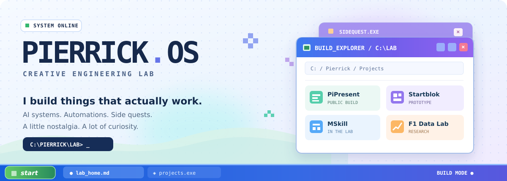

<!--
  PIERRICK.OS / THE BUILDER'S DESKTOP
  A GitHub-native interactive portfolio. No trackers, fake stats, or brittle widgets.
  Required visual asset: assets/desktop-banner.svg
-->

<p align="center">
  
</p>

<p align="center">
  <a href="#launchpad"><b>OPEN THE LAB</b></a> &nbsp;·&nbsp;
  <a href="#the-builder"><b>MEET THE BUILDER</b></a> &nbsp;·&nbsp;
  <a href="#skill-tree"><b>SKILL TREE</b></a> &nbsp;·&nbsp;
  <a href="https://www.linkedin.com/in/pierrick-van-hoecke/"><b>LET'S CONNECT ↗</b></a>
</p>

<p align="center">
  
  
  <a href="https://github.com/pierrickvhk?tab=repositories"></a>
</p>

> **Hey, I'm Pierrick.** I build practical AI systems at work and wonderfully curious things after hours. I like the messy middle between *"wouldn't it be cool if..."* and *"here's a working version."*
>
> This GitHub is my **creative engineering lab** — part portfolio, part notebook, part collection of side quests. Come for the code; stay for the experiments.

---

## Launchpad

```text
╭─ PIERRICK.OS ─────────────────────── [ MAIN MENU ] ─╮
│                                                    │
│  [01]  PROJECT EXPLORER   → things I've built       │
│  [02]  PLAYER PROFILE     → the person behind it    │
│  [03]  SKILL TREE         → unlocked / learning     │
│  [04]  BUILD LOG          → what's next             │
│                                                    │
│  C:\LAB> curiosity.exe --no-off-switch             │
╰────────────────────────────────────────────────────╯
```

### `01 / PROJECT EXPLORER` — click a folder

|  **[PiPresent](https://github.com/pierrickvhk/pipresent)** |  **Startblok** |
|:--|:--|
| **`PUBLIC · PYTHON / RASPBERRY PI`** <br> Turn a Pi into a reliable presentation player. USB in, media cached, fullscreen loop. Built because a black frame between videos was one black frame too many. <br><br> [**Explore source →**](https://github.com/pierrickvhk/pipresent) | **`PROTOTYPE · HUMAN-CENTRED APP`** <br> A gentler way to get started. Breaking overwhelming tasks into smaller actions, with emotional check-ins and room to build momentum. Created with a coaching practice. <br><br> *Public demo coming when ready.* |
| **MSkill Compass** | **Who's the Winner?** |
| **`IN DESIGN · LEARNING EXPERIENCE`** <br> A playful map of the Microsoft AI and automation ecosystem: documentation, learning paths and real builder challenges connected in one navigable skill graph. XP soul, modern AI polish. | **`RESEARCH · FORMULA 1 / DATA`** <br> Motorsport meets modelling. A sandbox for structured race data, explicit assumptions, predictions and honest backtesting — including the misses. |

<details>
<summary><b>▸ Show more side quests (.exe)</b></summary>

| Build | What I'm exploring |
|:--|:--|
| **AI DnB Mix Architect** | Drum & bass meets code: track analysis, cue discovery, sample exploration and creative sound design. |
| **[Immo Eliza](https://github.com/pierrickvhk/immo-eliza-deployment)** | Property-price prediction taken beyond the notebook, with FastAPI, Streamlit and Docker. |
| **[Delivery Market Analysis](https://github.com/pierrickvhk/delivery-market-analysis)** | From raw delivery data to a structured analytics pipeline and explorable dashboard. |
| **[Azure iRail](https://github.com/pierrickvhk/challenge-azure)** | Train-data ingestion and cloud automation using Azure. |

</details>

```text
  FEATURED / PiPresent                 HOW IT WORKS

  ┌─────────────┐   ┌─────────────────┐   ┌───────────┐
  │  USB DRIVE  ├──►│ CACHE + ROUTER  ├──►│ FULLSCREEN│
  │ PPT/PDF/MP4 │   │      PYTHON     │   │    LOOP   │
  └─────────────┘   └─────────────────┘   └───────────┘
        REAL PROBLEM → SMALL SYSTEM → WORKING PRODUCT
```

**My favourite builds have two ingredients:** a real problem worth solving and at least one technical rabbit hole worth exploring. A prototype is a prototype, not a shipped product — I label the difference.

---

## The builder

```text
╭─ PLAYER_PROFILE.ini ─────────────────────────────────╮
│                                                      │
│  HANDLE       @pierrickvhk                            │
│  NAME         Pierrick Van Hoecke                     │
│  CLASS        AI & Automation Engineer                │
│  CURRENT      ING Belgium                             │
│  BACKSTORY    Cloud Ops → Data & ML → AI Engineering  │
│  PASSIVE      Every good question becomes a project  │
│  PLAYSTYLE    Build → test → ship → improve            │
│                                                      │
│  MAIN QUEST   From AI builder to AI architect         │
│  SIDE QUEST   Become a Microsoft MVP                 │
╰──────────────────────────────────────────────────────╯
```

My background is a little nonlinear, and I like it that way. I started in **cloud operations**, trained in **AI & Data Engineering at BeCode**, and now work on AI and automation in an enterprise environment.

At **ING Belgium**, my work involves **Microsoft 365 Copilot, Copilot Studio and Power Automate**, with a growing focus on AI agents, governance and useful automations. The work has shaped how I think about production: not just *can it run?* but *can people safely rely on it?*

Outside work I swap enterprise problems for product ideas, hardware experiments, data projects and sometimes very loud drum & bass.

<sub>Work references here describe my role and general skills, not internal ING implementations, client data or confidential systems.</sub>

---

## Workbench

**What I reach for:**

`Python` · `FastAPI` · `pytest` · `pandas` · `scikit-learn` · `SQL` · `Docker` · `GitHub Actions` · `Azure` · `Microsoft Fabric` · `Microsoft 365 Copilot` · `Copilot Studio` · `Power Automate`

```text
       ┌───────────┐
       │ REAL NEED │
       └─────┬─────┘
             ▼
    ┌──────────────────┐
    │ SCOPE THE SMALLEST│
    │ USEFUL SOLUTION   │
    └─────────┬────────┘
              ▼
  ┌────────────────────────┐
  │  TYPE  /  TEST  /  LOG │
  │  DOCUMENT  /  DEPLOY  │
  └────────────┬───────────┘
               ▼
         [ SHIP v0.1 ] ───► [ LEARN ] ───► [ v0.2 ]
```

My rule: **a good demo is a start. A good README, tests and a reproducible setup make it a project.**

---

## Skill tree

```text
                  ╭────────────────────────────╮
                  │   ENTERPRISE AI ARCHITECT  │
                  │        [◆ NEXT QUEST]      │
                  ╰─────────────┬──────────────╯
                                │
                ┌───────────────┴────────────────┐
                ▼                                ▼
       ┌─────────────────┐              ┌──────────────────┐
       │ AGENTS + DESIGN │              │ CLOUD + DELIVERY │
       │ orchestration   │              │ APIs / CI / ops   │
       │ governance      │              │ observability    │
       └────────┬────────┘              └────────┬─────────┘
                │                                │
         ┌──────┴──────┐                  ┌──────┴──────┐
         ▼             ▼                  ▼             ▼
    COPILOT STUDIO  POWER AUTOMATE      AZURE       PYTHON / ML
         ●             ●                  ●             ●

   ● experience    ◆ learning next    ★ long-term ambition
```

**Unlocked:** `AZ-900` · Microsoft Applied Skills in Power Automate, Copilot Studio and autonomous agents.

**Currently exploring:** agent architecture, governance, evaluation, knowledge graphs and Microsoft certification paths. **The long game:** become the kind of engineer who can design, ship and responsibly scale an end-to-end AI system — and contribute enough to the community to earn Microsoft MVP recognition.

---

## Build log

```text
$ tail -f ~/pierrick/build.log

[SHIPPED]    PiPresent       USB-to-screen automation / public
[BUILDING]   Startblok       small steps, better beginnings
[DESIGNING]  MSkill Compass  explore Microsoft as a skill graph
[EXPLORING]  F1 Data Lab     learn from predictions + outcomes
[NEXT]       ???             there is always another idea

$ git commit -m "keep building"
```

I share work in progress, not just success stories. Expect experiments, architecture sketches, lessons from debugging, occasional deep dives and new releases as they happen.

### Stay for the next build

**[Follow my GitHub](https://github.com/pierrickvhk)** to see what ships next · **[Connect on LinkedIn](https://www.linkedin.com/in/pierrick-van-hoecke/)** to follow the journey outside the code · **[Explore all repos](https://github.com/pierrickvhk?tab=repositories)** to dive in.

<details>
<summary><b>▸ One last thing: open README_SECRET.txt</b></summary>

```text
   ╔═══════════════════════════════════════╗
   ║  ACHIEVEMENT UNLOCKED: FOUND THE LAB   ║
   ╠═══════════════════════════════════════╣
   ║                                       ║
   ║     [•_•]                             ║
   ║     /|_|\   HELLO, FELLOW BUILDER.    ║
   ║      / \                              ║
   ║                                       ║
   ║  If you made it this far, say hi.     ║
   ║  Bring an interesting problem.        ║
   ╚═══════════════════════════════════════╝
```

</details>

<p align="center"><sub>PIERRICK.OS — built with curiosity, powered by side quests. © 2026 Pierrick Van Hoecke</sub></p>
